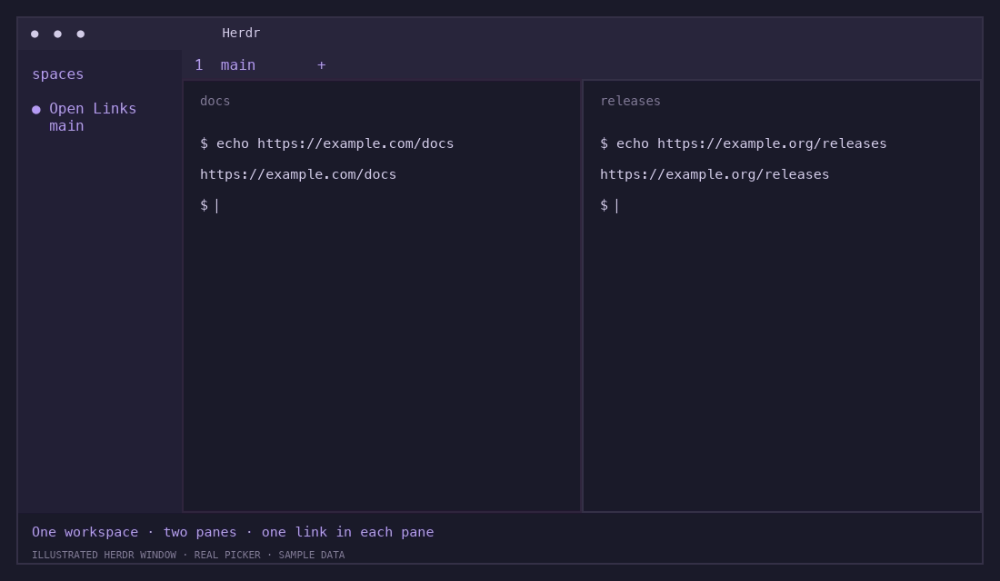

# Herdr Open Links

Open URLs, files, and folders from your current [Herdr](https://herdr.dev) pane.
No selecting text or copying—even for long sign-in URLs and wrapped paths.



**Requires macOS, Herdr 0.7.5+, and Node.js 18+.** No runtime dependencies or build step.

## Install

```sh
herdr plugin install hosikiti/herdr-open-links
herdr plugin action invoke hosikiti.open-links.setup-keys
```

The setup action adds **prefix → U**, then reloads Herdr. It preserves an
existing shortcut and refuses to overwrite another action using that key.

## Use

Press **Ctrl+B, then U** (the default Herdr prefix), then the letter beside a target.
With `prefix = "cmd+p"`, press **Cmd+P, then U** instead.

```text
Open Links

› a  web    https://example.com/docs
  s  folder /path/to/project/desktop/release
  d  file   /path/to/project/README.md
```

Web links open in your browser; files and folders use their macOS default app.
Supports HTTP/HTTPS, local `file://` URLs, existing paths, and terminal hyperlinks.

- `/` searches; Enter finishes searching.
- A letter or Enter opens a target.
- Up/Down selects; Left/Right changes page.
- Esc clears search or closes the picker.

## Local development

```sh
herdr plugin link "$HOME/projects/herdr-open-links"
herdr plugin action invoke hosikiti.open-links.setup-keys
npm test
```

Tests use built-in Node tools and need no install. For formatting:

```sh
npm ci
npm run format
npm run format:check
```

See [details](docs/DETAILS.md) for manual setup, Node discovery, limitations,
uninstalling, and a guide to the source files.

[MIT license](LICENSE) · hosikiti
